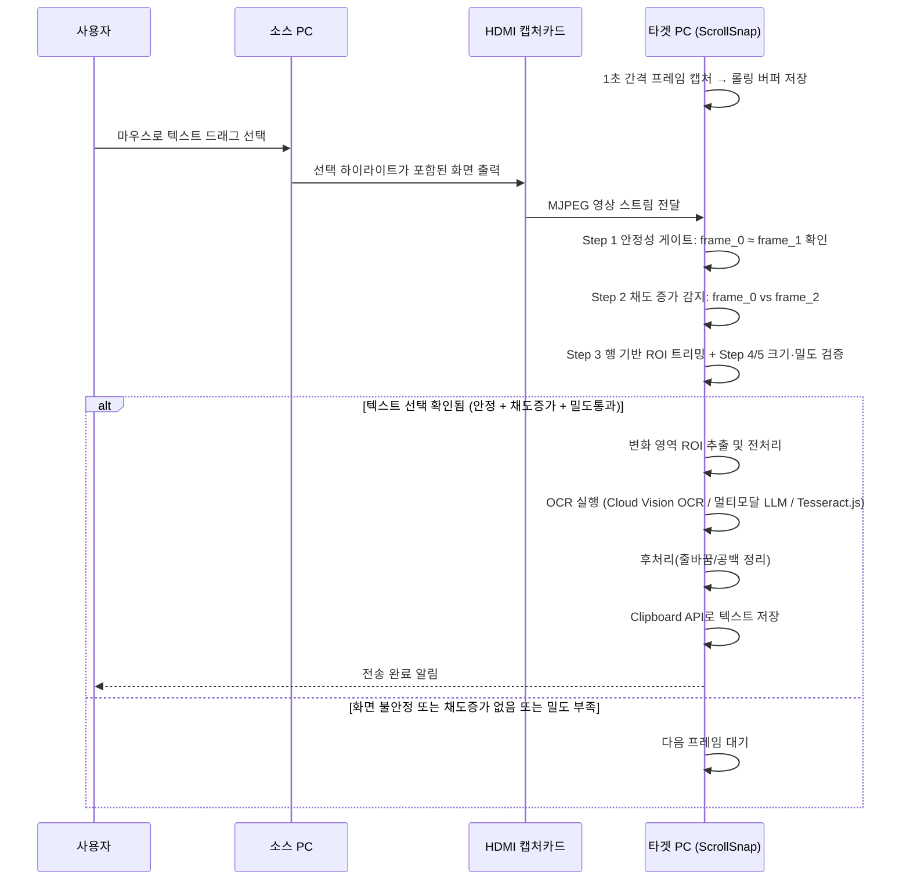
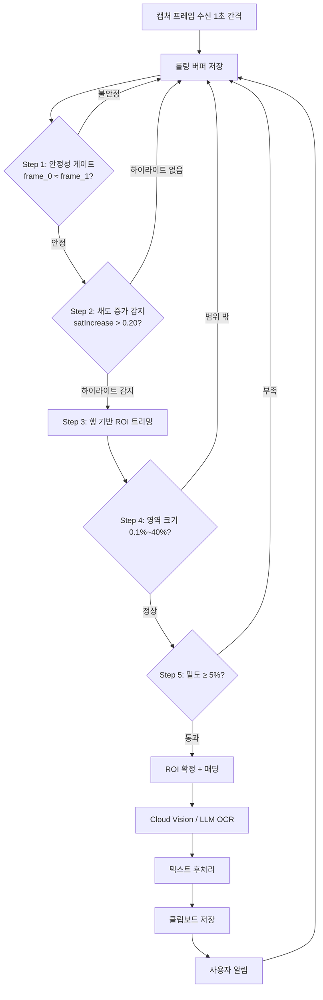

# ScrollSnap 텍스트 전송 방안: 블록 텍스트 전송

## 1. 제약 조건

| 제약 | 설명 |
|------|------|
| 소스 PC에 프로그램 설치 불가 | 어떤 소프트웨어도 설치하지 않음 |
| 소스 PC에 인터넷 없음 | 온라인 도구나 웹페이지 접속 불가 |
| 전송 경로는 HDMI만 가능 | HDMI → 캡처카드 → USB (단방향) |
| 역방향 통신 불가 | 타겟 PC가 소스 PC에 피드백 불가 |
| **소스 PC에 파일 전달 불가** | USB, 네트워크 등 어떤 방법으로도 소스 PC에 파일을 가져갈 수 없음 |
| **사람의 키보드 입력이 유일한 입력 수단** | 소스 PC에서 실행할 모든 코드는 사람이 직접 타이핑해야 함 |
| 터미널 사용 가능 | cmd.exe, PowerShell 사용 가능 |
| Windows 내장 도구만 사용 | PowerShell, .NET Framework, certutil, notepad, Edge 등 |

### 1.1 이 제약이 의미하는 것

```
소스 PC에서 가능한 것:
  ✅ cmd.exe / PowerShell 명령어 실행
  ✅ Windows 내장 프로그램 사용 (notepad, Edge, mspaint 등)
  ✅ PowerShell에서 .NET Framework 클래스 호출
  ✅ certutil로 파일을 base64로 변환
  ✅ 사람이 키보드로 코드/명령어 타이핑

소스 PC에서 불가능한 것:
  ❌ 외부에서 파일 가져오기 (USB, 네트워크 등)
  ❌ 인터넷에서 다운로드
  ❌ 소프트웨어 설치
  ❌ 외부 DLL / 라이브러리 사용
```

### 1.2 본 방안 고유 제약

| 항목 | 설명 |
|------|------|
| 소스 PC GUI/마우스 사용 가능 필요 | 사용자가 텍스트를 직접 드래그로 선택해야 하므로 포인터 조작이 가능해야 함 |
| 화면 내 선택 하이라이트 가시성 필요 | 텍스트 선택 영역(일반적으로 파란색 강조)이 HDMI 캡처 영상에서 명확히 보여야 함 |
| 드래그 선택 가능한 텍스트만 전송 가능 | 화면 이미지 내부 텍스트(예: 단순 스크린샷)는 블록 선택이 불가능하면 전송 대상에서 제외 |
| OCR 정확도의 화질 의존성 | 폰트 렌더링 선명도, 축소/스케일링, MJPEG 압축 강도에 따라 인식률이 변동 |

---

## 2. 방안: 블록 텍스트 전송

### 2.1 핵심 아이디어

소스 PC 사용자가 평소처럼 텍스트를 마우스로 드래그해 선택하면, 타겟 PC ScrollSnap은 **1초 간격으로 캡처한 프레임의 롤링 버퍼를 비교하여 텍스트 선택 상태를 자동 감지**한다. 화면이 안정된 상태에서 이전 프레임 대비 **채도가 증가한 픽셀**(= 하이라이트가 새로 나타난 위치)을 식별하고, 행(row) 기반 트리밍으로 노이즈를 제거한 뒤, 밀도 검증을 통과하면 텍스트 선택으로 판정한다. 해당 영역만 OCR하여 텍스트를 추출하고, 타겟 PC 클립보드에 즉시 반영한다.

### 2.2 전체 워크플로우



---

## 3. 소스 PC 상세 설계

### 3.1 사용자 입력 방식

소스 PC에서는 별도 스크립트, 명령어, 파일 준비 작업이 필요 없다. 사용자는 기존 업무 흐름 그대로 다음 동작만 수행한다.

```
1. 문서/웹/코드 뷰어에서 원하는 텍스트 구간으로 커서 이동
2. 마우스 클릭 + 드래그로 텍스트 선택(블록 하이라이트 생성)
3. 선택 완료 후 약 2초 내에 자동 감지 및 OCR 수행
4. 필요 시 다른 구간을 다시 선택 (연속 전송)
```

### 3.2 텍스트 선택 하이라이트 검출 원리

타겟 PC는 소스 OS나 앱 내부 상태를 직접 알 수 없으므로, **롤링 프레임 버퍼의 시간축 비교**와 **채도 증가 감지**로 선택 상태를 추정한다.

| 단계 | 처리 | 목적 |
|------|------|------|
| 프레임 버퍼링 | 1초 간격으로 캡처, 최근 3프레임(frame_0, frame_1, frame_2) 유지 | 시간축 비교 기반 확보 |
| 안정성 게이트 | frame_0과 frame_1 픽셀 차분 → 변화율 < 1%이면 "안정" 판정 | 드래그 중/스크롤 중 오탐 방지 |
| 채도 증가 감지 | frame_0과 frame_2 비교 → 채도가 증가한(saturation increase > 0.20 AND 절대 채도 > 0.20) 픽셀만 하이라이트로 판정 | 커서 깜박임·시계·애니메이션 등 저채도 변화 무시, 선택 하이라이트만 식별 |
| 행 기반 ROI 트리밍 | 하이라이트 픽셀의 행별(row) 분포를 집계, 피크 행 대비 10% 이상인 행만 남김 | MJPEG 압축 노이즈로 인한 산발적 거짓 픽셀을 제거, 바운딩 박스를 실제 선택 영역으로 좁힘 |
| 밀도 검증 | 트리밍된 ROI 내 하이라이트 픽셀 밀도 > 5% | 산발적 노이즈가 아닌 실제 집중된 하이라이트인지 확인 |
| ROI 확정 | 트리밍된 바운딩 박스 + 패딩(8px) 적용 | OCR 입력 영역 확정 |
### 3.3 안정성 및 변화 판정

롤링 프레임 버퍼의 비교를 통해 별도의 안정화 타이머 없이 텍스트 선택을 감지한다.

```
감지 판정 조건 (5단계 파이프라인):
- 캡처 간격: 1초 (configurable)
- 버퍼 깊이: 3프레임 (frame_0=현재, frame_1=1초 전, frame_2=2초 전)
- Step 1 안정 조건: frame_0 vs frame_1 변화율 < 1% (다운샘플 step=4 기준)
- Step 2 채도 증가 감지: frame_0 vs frame_2 비교, 채도 증가 > 0.20 AND 절대 채도 > 0.20인 픽셀 20개 이상
- Step 3 행 기반 트리밍: 피크 행 대비 10% 미만 행 제거 → 바운딩 박스 재계산
- Step 4 영역 크기: 트리밍된 ROI가 프레임의 0.1% ~ 40% 범위 내
- Step 5 밀도 검증: ROI 내 하이라이트 밀도 ≥ 5%
→ 5단계 모두 통과 시 OCR 트리거
```

> 프레임 버퍼 자체가 시간 기반 안정성을 내포한다. 1초 간격 × 3프레임 = 자연스러운 2초 관찰 윈도우. 별도의 안정화 타이머나 IoU 추적이 불필요하며, 선택 해제 시에는 채도 증가가 발생하지 않아 OCR이 트리거되지 않는다. MJPEG 압축 노이즈로 인한 거짓 채도 증가 픽셀은 행 기반 트리밍과 밀도 검증에서 걸러진다.

### 3.4 연속 선택(다중 전송) 지원

사용자가 여러 구간을 순서대로 복사하려는 상황을 기본 시나리오로 지원한다.

| 기능 | 동작 |
|------|------|
| 중복 방지 | 직전 OCR 결과와 유사도(예: Levenshtein/Jaccard) 비교 후 동일하면 알림만 갱신 |
| 재선택 감지 | 기존 ROI와 IoU가 낮아지면 새 선택 세션으로 전환 |
| 전송 큐 | OCR 작업 중 새로운 안정 선택이 생기면 최신 선택 우선 처리(이전 대기 작업 취소 가능) |
| 사용자 피드백 | 상태 배지: `감지 중` → `안정화 대기` → `OCR 처리` → `클립보드 저장` |

---

## 4. 타겟 PC 처리 파이프라인

### 4.1 프레임 버퍼 기반 감지

```
[입력] HDMI 캡처 프레임 (1초 간격)
   ↓
[롤링 버퍼 저장]
   - frame_0 (현재), frame_1 (1초 전), frame_2 (2초 전)
   ↓
[Step 1: 안정성 게이트]
   - frame_0 vs frame_1 픽셀 차분
   - 변화율 < 1% → 안정 → 다음 단계
   - 변화율 ≥ 1% → 불안정 → 대기
   ↓
[Step 2: 채도 증가 감지]
   - frame_0 vs frame_2 픽셀별 비교
   - 채도 증가 > 0.20 AND 절대 채도 > 0.20인 픽셀 추출
   - 하이라이트 픽셀 < 20 → 변화 없음 → 대기
   ↓
[Step 3: 행 기반 ROI 트리밍]
   - 행별 하이라이트 픽셀 수 집계
   - 피크 행 기준 10% 미만 행 제외
   - 바운딩 박스를 유효 행 범위로 축소
   ↓
[Step 4: 영역 크기 검증]
   - ROI 면적이 프레임의 0.1% ~ 40% 범위
   ↓
[Step 5: 밀도 검증]
   - 하이라이트 픽셀 / ROI 샘플 수 ≥ 5%
   ↓
[ROI 확정 + OCR 실행]
```

### 4.2 프레임 비교 기준

롤링 버퍼의 프레임 비교와 5단계 파이프라인을 통해 화면 안정성, 채도 증가, 공간 밀도를 동시에 판정한다.

| 단계 | 지표 | 기준 | 실패 시 처리 |
|------|------|------|-------------|
| Step 1 | 프레임 간 변화율 (frame_0 vs frame_1) | < 1% | 불안정 → 다음 프레임 대기 |
| Step 2 | 채도 증가 픽셀 수 (frame_0 vs frame_2) | ≥ 20 (satIncrease > 0.20, satAbsolute > 0.20) | 하이라이트 없음 → 대기 |
| Step 3 | 행 기반 트리밍 | 피크 행의 10% 이상인 행만 유지 | (항상 적용, 실패 없음) |
| Step 4 | 트리밍된 ROI 크기 | 프레임의 0.1% ~ 40% | 범위 밖 → 노이즈/전체화면 변화, 무시 |
| Step 5 | 하이라이트 밀도 | ≥ 5% | 산발적 노이즈 → 무시 |
### 4.3 OCR 처리

| 단계 | 처리 내용 |
|------|-----------|
| ROI 추출 | 선택 바운딩 박스를 원본 캡처 좌표에서 크롭 |
| 전처리 | 업스케일(2x), 샤프닝, 대비 보정, 선택 하이라이트 제거(배경 복원) 및 필요 시 색 반전으로 글자 대비 강화 |
| Cloud Vision OCR | Google Cloud Vision API에 이미지 전달, 전용 OCR로 텍스트 추출 (프롬프트 불필요) |
| LLM OCR | 멀티모달 LLM에 이미지 + 지시문 전달해 텍스트 추출 |
| 후처리 | 불필요 개행 제거, 공백 정규화, 코드/문장 패턴 보정 |

### 4.4 클립보드 연동

브라우저 권한 모델을 따르며, 사용자 제스처 기반 트리거(선택/버튼/단축 UI)와 결합한다.

```javascript
async function saveToClipboard(text) {
  await navigator.clipboard.writeText(text);
  notify(`텍스트 전송 완료 (${text.length}자)`);
}
```

### 4.5 파이프라인 다이어그램



---

## 5. OCR 엔진 연동

### 5.1 지원 프로바이더

| 프로바이더 | 모델 예시 | 특징 |
|------------|----------|------|
| Google Cloud Vision | DOCUMENT_TEXT_DETECTION | 전용 OCR API, 프롬프트 불필요, 빠른 응답(~300~800ms), 구조화된 출력. 코드 문맥 교정 없음 |
| OpenAI | GPT-4.1 / GPT-4o | 이미지+텍스트 동시 입력 OCR 품질 우수, 응답 속도 안정 |
| Anthropic | Claude Sonnet 4 | 장문 정리 및 문맥 보정 강점. `Claude Max`는 claude.ai 앱 구독이며 API 사용량/요금과는 별도 |
| Google | Gemini 2.x 계열 | 멀티모달 API 선택 폭, 비용/성능 조합 다양 |

### 5.2 API 키 등록 및 저장

```
1. 설정 패널에서 Provider 선택
2. API Key 입력
3. "연결 테스트" 버튼으로 유효성 확인
4. 성공 시 브라우저 저장소(sessionStorage/localStorage) 저장 여부를 사용자가 선택
5. OCR 요청 시 선택 Provider로 라우팅
```

> Google Cloud Vision도 동일한 API Key 등록/테스트 플로우를 사용한다.

> 브라우저 저장소의 "암호화/난독화"만으로는 키 보호가 충분하지 않다. 기본값은 미저장(세션 메모리)로 두고, 운영 환경에서는 세션 토큰/보안 스토리지/프록시 키 위임 구조를 권장한다.

### 5.3 연결 테스트 시나리오

| 테스트 항목 | 성공 조건 |
|-------------|-----------|
| 키 형식 검증 | 빈 값/형식 오류 즉시 차단 |
| Cloud Vision OCR 요청 | 더미 이미지로 `TEXT_DETECTION`/`DOCUMENT_TEXT_DETECTION` 호출 시 정상 응답 |
| 샘플 OCR 요청 | 더미 이미지 요청에 정상 응답 |
| 응답 시간 측정 | 타임아웃 임계(예: 8초) 내 완료 |
| 에러 메시지 파싱 | 요금/권한/쿼터 에러를 사용자 친화적으로 변환 |

### 5.4 Tesseract.js 폴백

외부 API가 불가한 환경에서 로컬 OCR 폴백을 제공한다.

| 항목 | 동작 |
|------|------|
| 트리거 | API 키 미설정, 네트워크 오류, 쿼터 초과 (LLM 및 Cloud Vision 모두 실패 시) |
| 엔진 | Tesseract.js (`createWorker('eng+kor')` 형태, 언어팩 eng+kor 조합) |
| 장점 | 오프라인 동작 가능, 추가 과금 없음 |
| 단점 | 저해상도/압축 노이즈 환경에서 정확도 및 속도 저하 가능 |

---

## 6. 예상 성능

### 6.1 단계별 지연 시간 추정

```
총 소요 시간 = 프레임 버퍼 안정화 + 변화 검출/채도 판별 + OCR 처리 + 클립보드 반영

기준 환경(1080p 캡처, 일반 사무 문서 폰트):
- 프레임 버퍼 안정화: 2.0초 (1초 간격 × 3프레임 채움 후 안정 판정)
- 변화 검출 + 채도 판별: 10~30ms
- LLM OCR: 500~2600ms (Provider/네트워크/텍스트량 의존)
- Cloud Vision OCR: 300~800ms (이미지 크기 의존)
- 후처리 + 클립보드 저장: 20~80ms
→ 체감 완료: 약 2.3~4.7초
```

### 6.2 텍스트 크기별 예상 처리 시간

| 텍스트 크기(선택 범위) | 예시 | 안정화 + OCR 예상 시간 | 정확도 경향 |
|------------------------|------|-------------------------|------------|
| 소형 (1~2줄, 20~120자) | 문장 한두 줄 | ~2.3~3.0초 | 매우 높음 |
| 중형 (3~8줄, 120~500자) | 단락/코드 블록 일부 | ~2.8~3.7초 | 높음 |
| 대형 (9~20줄, 500~1500자) | 로그/코드 다중 라인 | ~3.4~5.0초 | 중간~높음 |
| 초대형 (20줄+, 1500자+) | 긴 문서 단위 선택 | ~4.5초+ | 레이아웃 왜곡 시 저하 가능 |

> 대형 범위는 한 번에 선택하기보다 의미 단위(문단/함수)로 나눠 선택하면 정확도와 체감 속도가 모두 개선된다.

---

## 7. 리스크 및 완화 전략

| 리스크 | 영향 | 완화 전략 |
|--------|------|----------|
| 채도 기반 판별의 한계 (극단적 저채도 테마) | 회색 하이라이트 테마에서 선택 영역 미검출 | 채도 임계치 사용자 조정 UI 제공, 대안 전략으로 픽셀 변화량 기반 폴백 |
| OCR 오인식(유사 문자, 줄바꿈 오류) | 잘못된 텍스트 클립보드 저장 | 후처리 규칙(공백/개행 정규화), 재시도 버튼, 원본 ROI 미리보기 확인 |
| Cloud Vision의 문맥 비이해로 유사 문자 교정 약함(0/O, 1/l) | 코드/식별자 오인식 누적 가능 | 식별자 패턴 후처리, 사용자 재검수 UI, 필요 시 LLM 교차 검증 |
| 다크 테마/고대비 테마에서 문자 대비 약함 | 인식률 저하 | 대비 증강 전처리, 이진화 파라미터 자동 탐색 |
| 사용자의 빠른 재선택/연속 드래그 | OCR 중복 실행, 지연 증가 | 롤링 버퍼가 자연스럽게 처리 — 불안정 상태에서는 OCR 미실행, 최신 선택 우선 |
| 화면 일부만 선택되어 문맥 단절 | 문장 파편화, 해석 어려움 | 선택 상하 여백 자동 확장 옵션, 문맥 보강 후처리 |
| 부분 가림(툴팁/커서/알림) | ROI 오염으로 OCR 오류 | 프레임 품질 점수 낮으면 OCR 보류, 다음 안정 프레임 재시도 |
| MJPEG 압축 노이즈 심함 | 문자 경계 손실 | 업스케일/샤프닝 강화, 가능 시 캡처 품질 상향 |
| 외부 API(LLM/Cloud Vision) 요금/쿼터 초과 | OCR 실패 또는 비용 증가 | 요청 길이 제한, 모델 등급 선택, 쿼터 임계 경고, Tesseract.js 자동 폴백 |
| 브라우저 저장소 API 키 노출 | 인증 정보 유출 위험 | 기본값 미저장, 저장 시 sessionStorage 우선, 키 즉시 삭제/재입력 UI 제공 |
| 클립보드 권한 거부 | 저장 실패 | 사용자 제스처 기반 재요청, 수동 복사 모달 폴백 |

---

## 8. 구현 로드맵

| 순서 | 단계 | 내용 | 난이도 |
|------|------|------|--------|
| 1 | 롤링 버퍼 + 안정성 게이트 MVP | 1초 간격 캡처, 3-프레임 버퍼, 픽셀 차분 안정성 판정 | 낮음 |
| 2 | 변화 검출 + 채도 판별 | 프레임 간 차분으로 변화 영역 추출, 채도 기반 선택/해제 판별 | 중간 |
| 3 | OCR 통합 1차 | 단일 Provider 연동 + 기본 후처리 | 중간 |
| 4 | 클립보드/알림 UX | Clipboard API 저장, 성공/실패 토스트, 상태 배지 | 낮음 |
| 5 | 멀티 Provider 확장 | Provider 추상화, API 키 설정/테스트, 장애 시 재시도 | 중간 |
| 6 | Tesseract.js 폴백 | 오프라인 OCR 경로 및 성능 튜닝 | 중간 |
| 7 | 신뢰성 고도화 | 채도 임계치 자동 보정, 다크모드 적응, 연속 선택 최적화 | 높음 |
| 8 | 실환경 검증 | 캡처카드/해상도/폰트 조합 테스트 및 임계값 보정 | 높음 |

---

## 9. 사용 시나리오

### 시나리오 1: 사내 문서 뷰어에서 정책 문장 추출

```
상황: 소스 PC의 사내 문서 시스템에서 정책 문구를 복사해야 함
동작: 사용자가 문장을 드래그해 선택 → 약 2~5초 내 타겟 PC 클립보드 반영
결과: 메신저/메일에 즉시 붙여넣기 가능
```

### 시나리오 2: 원격 개발 환경 로그 일부 전송

```
상황: 소스 PC 터미널 로그에서 에러 스택 일부만 공유 필요
동작: 필요한 라인만 블록 선택 → 안정화 후 OCR 추출
결과: 타겟 PC에서 이슈 트래커에 바로 첨부
```

### 시나리오 3: 코드 리뷰 중 함수 블록 복사

```
상황: 소스 PC IDE 화면에서 특정 함수만 전달 필요
동작: 함수 블록 드래그 선택 → OCR → 클립보드 저장
결과: 타겟 PC 에디터에 붙여넣어 빠른 분석/수정 진행
```

---

## 10. 결론

블록 텍스트 전송은 소스 PC에서 **추가 설치·스크립트 입력 없이** 마우스 드래그만으로 텍스트를 전달할 수 있는 실용적 방식이다. 타겟 PC는 롤링 프레임 버퍼의 시간축 비교와 채도 증가 감지를 통해 텍스트 선택 상태를 자동 감지하고, 행 기반 트리밍과 밀도 검증으로 MJPEG 압축 노이즈를 걸러낸다. 선택 해제 시에는 채도 증가가 발생하지 않아 자연스럽게 무시된다. 추출 결과를 클립보드에 즉시 반영해 사용자 작업 흐름을 끊지 않는다.

핵심 성공 조건은 (1) 채도 증가 기반 하이라이트 감지의 정확도, (2) 행 기반 트리밍으로 압축 노이즈 제거, (3) OCR 엔진 다중화(LLM + Cloud Vision OCR + Tesseract 폴백)다. 이 세 축을 충족하면 제약 환경에서도 높은 사용성을 제공하는 텍스트 전송 경로를 확보할 수 있다.

---

*문서 작성일: 2026-03-01*
*프로젝트: ScrollSnap*
