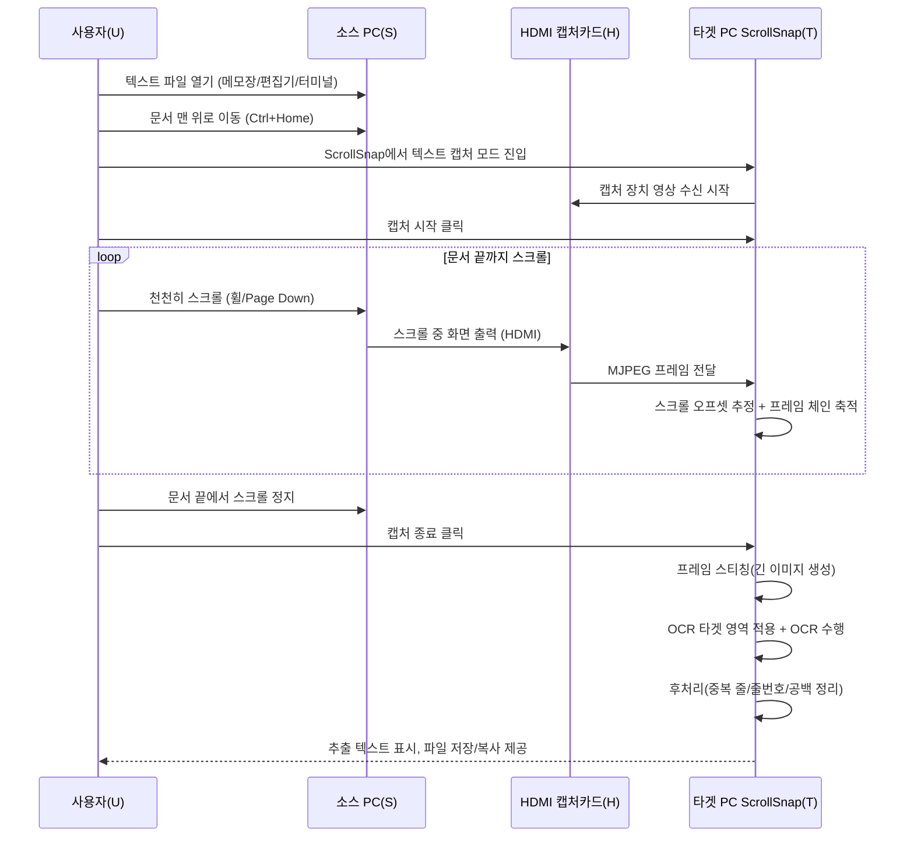

# ScrollSnap 텍스트 전송 방안: 화면 텍스트 직접 캡처 전송

## 1. 배경

### 1.1 핵심 아이디어

```
소스 PC: 텍스트 파일을 뷰어로 열고 스크롤
    → HDMI → 캡처카드 →
타겟 PC: 스크롤 캡처 → 이미지 스티칭 → OCR → 텍스트 복원
```

ScrollSnap의 스크롤 캡처 + OCR 기능을 조합하면, **소스 PC에서 아무런 사전 작업 없이** 텍스트를 전송할 수 있다.

---

## 2. 제약 조건

### 2.1 공통 제약

| 제약 | 설명 |
|------|------|
| 소스 PC에 프로그램 설치 불가 | 어떤 소프트웨어도 설치하지 않음 |
| 소스 PC에 인터넷 없음 | 온라인 도구나 웹페이지 접속 불가 |
| 전송 경로는 HDMI만 가능 | HDMI → 캡처카드 → USB (단방향) |
| 역방향 통신 불가 | 타겟 PC가 소스 PC에 피드백 불가 |
| **소스 PC에 파일 전달 불가** | USB, 네트워크 등 어떤 방법으로도 소스 PC에 파일을 가져갈 수 없음 |
| **사람의 키보드 입력이 유일한 입력 수단** | 소스 PC에서 실행할 모든 코드는 사람이 직접 타이핑해야 함 |
| 터미널 사용 가능 | cmd.exe, PowerShell 사용 가능 |
| Windows 내장 도구만 사용 | PowerShell, .NET Framework, certutil, notepad, Edge 등 |

#### 2.1.1 이 제약이 의미하는 것

```
소스 PC에서 가능한 것:
  ✅ cmd.exe / PowerShell 명령어 실행
  ✅ Windows 내장 프로그램 사용 (notepad, Edge, mspaint 등)
  ✅ PowerShell에서 .NET Framework 클래스 호출
  ✅ certutil로 파일을 base64로 변환
  ✅ 사람이 키보드로 코드/명령어 타이핑

소스 PC에서 불가능한 것:
  ❌ 외부에서 파일 가져오기 (USB, 네트워크 등)
  ❌ 인터넷에서 다운로드
  ❌ 소프트웨어 설치
  ❌ 외부 DLL / 라이브러리 사용
```

### 2.2 본 방안 고유 제약

| 제약 | 설명 |
|------|------|
| **텍스트만 전송 가능** | 바이너리 파일(이미지, PPT, ZIP 등)은 전송 불가 |
| **OCR 정확도에 의존** | 화면 텍스트 OCR이므로 100% 무결성 보장 불가 |
| 화면에 보이는 텍스트만 대상 | 숨겨진 내용(접힌 코드 블록 등)은 캡처 불가 |

### 2.3 이 방안이 적합한 대상

```
적합:
  ✅ 소스 코드 (.py, .js, .java, .c, .html, .css 등)
  ✅ 설정 파일 (.json, .yaml, .xml, .ini, .env 등)
  ✅ 로그 파일 (.log, .txt)
  ✅ 일반 텍스트 문서 (.txt, .md)
  ✅ 터미널 출력 (명령어 결과, 시스템 정보)

부적합:
  ❌ 바이너리 파일 (이미지, 동영상, 압축파일 등)
  ❌ 암호화된 파일
  ❌ 대용량 텍스트 (수천 줄 이상은 시간이 많이 소요됨)
```

---

## 3. 전체 워크플로우



**핵심: 소스 PC에서의 사전 작업이 전혀 없다.** 명령어 입력, 스크립트 타이핑, 인코딩 과정 일체 불필요. 파일을 열고 스크롤하면 끝이다.

---

## 4. 소스 PC 상세

### 4.1 사용자 작업

소스 PC에서의 작업은 극도로 단순하다:

1. 전송할 파일을 텍스트 뷰어(메모장, 편집기, 터미널)로 연다
2. 문서의 맨 위로 이동한다 (`Ctrl+Home`)
3. 천천히 아래로 스크롤한다
4. 문서 끝에 도달하면 멈춘다

### 4.2 화면 설정 권장사항

OCR 정확도를 최대화하기 위한 소스 PC 화면 설정:

| 항목 | 권장 설정 | 이유 |
|------|----------|------|
| 폰트 | 고정폭 (Consolas, D2Coding, Courier New) | 문자 간격 일정 → OCR 정확도 향상 |
| 폰트 크기 | 14pt 이상 | 캡처 해상도에서 문자당 충분한 픽셀 확보 |
| 테마 | 밝은 배경 + 어두운 텍스트 | OCR 엔진이 밝은 배경에서 최적 동작 |
| 줄 번호 | 끄기 권장 | 줄 번호가 텍스트에 포함되는 것 방지 |
| 줄 바꿈 (word wrap) | 끄기 권장 | 원본 줄 구조 보존 |
| 미니맵/사이드바 | 끄기 | 텍스트 영역 최대화 |
| 구문 강조 | 유지 가능 | LLM OCR은 색상 구문 강조가 있어도 정확히 인식 |
| 화면 해상도 | 1920×1080 | 캡처카드 최적 해상도 |
| DPI 스케일링 | 100% 권장 | 125%/150% 스케일링 시 텍스트 렌더링 변형으로 OCR 정확도 저하 가능 |
| ClearType | 기본 유지 | ClearType 서브픽셀 렌더링은 MJPEG 압축 후에도 OCR에 큰 영향 없음 |

### 4.3 스크롤 방법

| 방법 | 설명 | 권장도 |
|------|------|--------|
| 마우스 휠 | 가장 자연스러움. 속도 조절 용이 | ✅ 권장 |
| Page Down | 페이지 단위 스크롤. 겹침 영역이 적어 프레임 매칭 실패 가능 | ⚠️ 주의 필요 |
| 스크롤바 드래그 | 빠르지만 속도 불균일 | ❌ 비권장 |
| 키보드 화살표 | 줄 단위. 정확하지만 매우 느림 | 🔹 소량에만 |

> **스크롤 속도**: 초당 3~5줄 이내 권장. ScrollSnap의 프레임 매칭이 안정적으로 동작하려면 인접 프레임 간 충분한 겹침(설계 기준 30% 이상)이 필요하므로, 과도한 스크롤 속도는 프레임 누락을 유발한다.

> **⚠️ 역방향 스크롤 금지**: 캡처 중 위로 스크롤하면 프레임 체인이 깨져 결과물에 누락/중복이 발생합니다. 실수로 역방향 스크롤한 경우 캡처를 중단하고 새로 시작하세요. ScrollSnap은 역방향 스크롤을 기술적으로 방어하지 않습니다.

---

## 5. 타겟 PC 처리 파이프라인

### 5.1 파이프라인 구조

```
캡처카드 영상 (1920×1080, 30fps)
    ↓
[1단계] 스크롤 캡처
    - 사용자 지정 크롭 영역(ROI)을 캡처 시점에 적용하여 브라우저 크롬(주소창, 북마크바, 독) 제외
    - 프레임 간 NCC 매칭으로 스크롤 오프셋 계산 (anti-periodic 로직으로 주기적 패턴 대응)
    - 스크롤 진행 방향 감지
    - 스크롤 정지 감지 (동일 프레임 연속)
    - 프레임 2장만 유지하고, 매 프레임에서 새로 드러난 영역(스트립)을 즉시 추출
    ↓
[2단계] 이미지 스티칭
    - 캡처 중 추출된 스트립들을 하나의 긴 이미지로 결합 (프레임 전체가 아닌 신규 콘텐츠 스트립만 사용)
    - 겹침 영역 제거
    - 최종 이미지: 1920 × N px (N은 문서 길이에 비례, 브라우저 Canvas 최대 높이 제한 ~16,384~32,767px에 유의)
    ↓
[3단계] OCR 타겟 영역 선택 그리드
    - 라이브 프리뷰 위 격자 오버레이로 OCR 대상 영역 지정
    - 텍스트 본문만 포함하도록 수동 ROI 확정
    ↓
[4단계] OCR 수행
    - 방법 A: Tesseract.js (로컬, 무료)
    - 방법 B: Google Cloud Vision OCR API (클라우드, 전용 OCR)
    - 방법 C: 멀티모달 LLM Vision API (클라우드, 고정밀)
    - 이미지를 적절한 크기로 분할하여 OCR
    ↓
[5단계] 텍스트 후처리
    - 분할 OCR 겹침에 의한 중복 줄 제거
    - 줄 번호 제거 (에디터가 표시한 경우)
    - 공백/탭 정규화 (선택적 — Makefile 등 탭 의미가 있는 파일에서는 비활성화)
    - 인코딩 정리 (UTF-8)
    ↓
[6단계] 결과 출력
    - 화면에 텍스트 표시 (편집 가능)
    - 파일로 저장 (.txt, .py, .json 등)
    - 클립보드 복사
```

### 5.2 스크롤 캡처

본 방안의 스크롤 캡처는 ScrollSnap의 스크롤 캡처 기능을 **그대로 사용**한다:

- 프레임 간 NCC (Normalized Cross-Correlation) 매칭: 사용자 지정 크롭 영역(ROI)을 캡처 시점에 적용하여 브라우저 크롬을 제외한 상태로 매칭. 성능을 위해 그레이스케일 축소(50%) 이미지를 사용
- Anti-periodic 로직: 표/반복 패턴에서 주기적 NCC 피크를 방지하는 최소 shift 선택 전략 적용
- 신뢰도 임계치(0.5) 이하 매칭 결과는 포기하여 오매칭 방지
- 스크롤 오프셋 계산 및 프레임 체인 구성
- 이미지 스티칭 (겹침 제거 + 결합)

핵심 매칭/체인 구성 자체는 재사용한다. 다만 6장에 정의한 속도 대응·메모리 관리 계층은 기존 캡처 파이프라인 위에 추가 구현이 필요하다.

### 5.3 OCR 타겟 영역 선택 그리드

타겟 PC 웹앱은 캡처카드의 **라이브 비디오 프리뷰 위에 인터랙티브 그리드 오버레이**를 제공한다. 사용자는 마우스로 드래그하여 OCR 대상 영역을 직접 지정한다.

```
+--------------------------------------------------+
| [제목 바: filename.py - Notepad]                 |  ← 제외(딤 처리)
+--------------------------------------------------+
| [줄번호] │  def hello():                         |
| [줄번호] │      print("Hello, World!")            |  ← 선택 영역(하이라이트)
| [줄번호] │                                       |
| [줄번호] │  def main():                          |
|          │      hello()                          |
+--------------------------------------------------+
| [상태 바: Ln 1, Col 1  UTF-8  LF  Python]        |  ← 제외(딤 처리)
+--------------------------------------------------+
                                         [스크롤바] |  ← 제외(딤 처리)
```

**세부 동작 사양:**

1. **그리드 해상도**: 기본 48×27(약 40px 셀), 고정밀 모드 96×54(약 20px 셀) 지원
2. **드래그 상호작용**: 마우스 다운 지점부터 업 지점까지 직사각형 ROI 지정, 핸들로 재조정 가능
3. **시각 피드백**:
   - 선택 영역: 반투명 강조(예: 20% 오버레이) + 외곽선
   - 제외 영역: 딤 처리(예: 45% 어둡게)
   - 현재 셀 좌표/픽셀 좌표 툴팁 표시
4. **UI 요소 배제 목적**: 제목 바, 상태 바, 줄 번호, 스크롤바, 미니맵 등 비본문 영역을 명시적으로 제외
5. **프리셋/재사용**: 최근 ROI를 세션 단위로 기억하고, 같은 해상도 입력에서 기본값으로 재적용

> 자동 추정보다 사용자가 직접 ROI를 확정하는 방식이 코드/설정 파일 OCR에서 재현성이 높다.

### 5.4 OCR 제공자 설정 및 API 키 등록

OCR 모드에서 사용자는 제공자를 선택하고 API 키를 등록할 수 있다. 제공자 선택 UI는 `Tesseract(로컬)`, `Google Cloud Vision OCR(클라우드 전용 OCR)`, `LLM API(클라우드)`를 함께 노출한다.

| 제공자 | 로그인 방식 | 지원 모델/기능 | 강점 |
|--------|------------|----------|------|
| OpenAI (ChatGPT 계열) | API Key 입력 후 저장 | GPT-4o | 코드/문맥 보정, 혼합 언어 인식, 안정적 응답 |
| Claude (Anthropic) | API Key 입력 후 저장 | Claude 3.5 Sonnet, Claude 4 Sonnet | 긴 문맥 유지, 서식 보존, 코드 블록 구조 인식 |
| Google Gemini | API Key 입력 후 저장 | Gemini 2.0 Flash, Gemini 1.5 Pro | 속도-비용 선택 폭, 대량 청크 병렬 처리 용이 |
| Google Cloud Vision | API Key 입력 후 저장 | DOCUMENT_TEXT_DETECTION 기능 | 전용 OCR API, 프롬프트 불필요, 빠른 응답, 구조화된 출력(바운딩 박스/단락/단어) |

**설정/보안 정책:**

- API 키는 브라우저 `localStorage`에만 저장하며, 앱의 외부 중계 서버/백엔드로 전송하지 않음
- 프로젝트 외부 백엔드 저장소에 키를 전송하지 않음
- `localStorage` 저장 특성상 XSS에 취약할 수 있으므로, 키 입력 화면에는 임의 스크립트 삽입 지점을 두지 않고 공유 PC에서는 작업 후 키 삭제를 권장
- "연결 테스트" 버튼으로 모델 목록 조회 또는 소형 샘플 OCR 호출을 수행해 키 유효성 확인
- 제공자별 기본 모델 프리셋 제공(정확도 우선/속도 우선)
- Claude Max 구독(claude.ai)과 Anthropic API 사용량은 별도 과금/한도 체계이므로, Anthropic Console에서 API 키를 별도로 발급해 등록해야 함

### 5.5 OCR 전략

#### 방법 A: Tesseract.js (로컬)

```javascript
// 로컬 OCR: 인터넷 불필요, 무료 (Tesseract.js v5)
const worker = await Tesseract.createWorker('eng+kor');
await worker.setParameters({
    tessedit_pageseg_mode: Tesseract.PSM.SINGLE_BLOCK,
    preserve_interword_spaces: '1',
});
const { data: { text } } = await worker.recognize(image);
await worker.terminate();
```

| 장점 | 단점 |
|------|------|
| 인터넷 불필요 | 정확도 한계 (특수문자, 코드 구문) |
| 무료 | 한국어 혼합 시 정확도 저하 |
| 빠름 (로컬 처리) | 들여쓰기/포맷 보존 어려움 |

#### 방법 B: Google Cloud Vision OCR API (클라우드, 전용 OCR)

```javascript
// Google Cloud Vision API: 전용 OCR, 프롬프트 불필요 (API Key 또는 OAuth 인증)
const response = await fetch(
    `https://vision.googleapis.com/v1/images:annotate?key=${apiKey}`,
    {
        method: 'POST',
        headers: { 'Content-Type': 'application/json' },
        body: JSON.stringify({
            requests: [{
                image: { content: base64Image },
                features: [{ type: 'DOCUMENT_TEXT_DETECTION' }]
            }]
        })
    }
);
const result = await response.json();
const text = result.responses[0].fullTextAnnotation.text;
```

| 장점 | 단점 |
|------|------|
| 전용 OCR 엔진 | API 키 필요 |
| 프롬프트 불필요 | 비용 발생(월 1,000회 무료 후 건당 과금) |
| 구조화된 응답(바운딩 박스/단락/단어) | 코드 문맥 이해 없음 |
| LLM 대비 빠름(~300~800ms) | 인터넷 필요 (타겟 PC) |
| 한국어/영어 혼합 지원 | 보안 주의: 이미지가 외부 API로 전송됨 |

#### 방법 C: 멀티모달 LLM Vision API (클라우드)

```javascript
// 제공자 선택 기반 LLM OCR 호출 예시
const extractedText = await runVisionOCR({
    provider: 'openai', // 'anthropic' | 'gemini'
    model: 'gpt-4o',
    imageDataUrl,
    prompt: EXTRACTION_PROMPT,
});
```

| 장점 | 단점 |
|------|------|
| **높은 정확도** (코드 구조/문맥 이해) | API 키 필요 |
| 한국어 + 영어 혼합 대응 | 비용 발생 |
| 들여쓰기/포맷 보존 | 인터넷 필요 (타겟 PC) |
| 구문 강조된 코드도 인식 가능 | 대용량 이미지 시 분할 필요 |
| | **보안 주의: 이미지가 외부 API로 전송됨** |

#### 권장: 3계층 OCR 전략 + 자동 폴백

```
사용자 선택 → 선택된 OCR 제공자로 처리
  ├── 멀티모달 LLM Vision API (고정밀, 코드 문맥 이해)
  ├── Google Cloud Vision OCR (전용 OCR, 빠른 응답)
  └── Tesseract.js (로컬, 무료)

클라우드 서비스 실패 시 → Tesseract.js 자동 폴백
API 키 미등록 시 → Tesseract.js 자동 선택
```

### 5.6 OCR 이미지 분할

LLM Vision API 및 Google Cloud Vision API는 입력 이미지의 해상도/용량 제한이 있다. 스티칭된 이미지가 긴 경우 분할이 필요하다. 특히 Cloud Vision API는 인라인 base64 전송 시 JSON 요청 본문 10MB 제한이 있어 더 작은 청크가 필요하며, 파일 자체 한도는 20MB이므로(Cloud Storage URL 사용 시) 이를 함께 고려해야 한다:

```
스티칭 이미지 (1920 × 12,000 px)
    ↓ 줄 경계에서 분할 (줄 중간이 잘리지 않도록)
청크 1: 1920 × 2,000 px  (하단 100px 겹침 포함, 높이는 제공자별 입력 제한/비용을 고려해 1,500~2,000px 권장)
청크 2: 1920 × 2,000 px  (상·하단 100px 겹침 포함)
청크 3: 1920 × 2,000 px  (상·하단 100px 겹침 포함)
...
청크 N: 1920 × 나머지 px
    ↓ 각 청크 별도 OCR
    ↓ 결과 병합 + 겹침 줄 중복 제거
```

분할 지점은 **줄 사이의 빈 공간**(밝기 변화가 적은 수평 라인)을 감지하여 결정한다.

### 5.7 텍스트 후처리

OCR 결과에 대한 후처리 파이프라인:

| 단계 | 처리 | 설명 |
|------|------|------|
| 1 | 중복 줄 제거 | 분할 OCR 겹침 영역에서 동일 줄이 중복 추출됨. 연속 동일 줄 제거 |
| 2 | 줄 번호 제거 | 에디터 줄 번호가 포함된 경우 정규식 감지: `/^\s*\d+\s*[│\|]\s?/` |
| 3 | 트레일링 공백 제거 | 줄 끝의 불필요한 공백 제거 |
| 4 | 들여쓰기 정규화 | OCR이 탭을 공백으로 변환한 경우, 들여쓰기 단위(2칸/4칸) 감지하여 복원 (선택적 — Makefile 등 탭 의미가 있는 파일에서는 비활성화) |
| 5 | 인코딩 통일 | UTF-8로 출력 |
| 6 | 형식 검증 (선택적) | 추출된 텍스트가 JSON/YAML/XML인 경우 파서로 문법 검증, 코드인 경우 린터로 기본 검증 수행. 오류 발견 시 사용자에게 알림 |

---

## 6. 스크롤 속도 대응 전략

### 6.1 Adaptive Frame Sampling

스크롤 속도 추정값에 따라 프레임 샘플링 주기를 동적으로 조정한다.

- 저속 구간: 샘플링 간격 확대(예: 5fps)
- 중속 구간: 기본 샘플링(예: 10fps)
- 고속 구간: 샘플링 간격 축소(예: 20~30fps)
- 목표: 프레임 간 최소 겹침 30% 이상 유지

### 6.2 Scroll Speed Detection

연속 프레임의 픽셀 변위(수직 이동량)를 실시간 계산하여 스크롤 속도를 추정한다.

- `speed = deltaY(px) / deltaT(s)`
- 변위 계산은 NCC 매칭 결과와 옵티컬 플로우 보조값을 결합
- 순간값 + 이동평균(EMA) 동시 표시로 노이즈 완화

### 6.3 Fast Scroll Warning

신뢰 가능한 캡처 임계치를 초과하면 즉시 시각 경고를 표시한다.

- 경고 조건: `predictedOverlap < 30%`
- UI: 상단 배너 "스크롤이 너무 빠릅니다"
- 경고 중에는 캡처 품질 지표를 붉은색으로 전환

### 6.4 Frame Overlap Validation

모든 채택 프레임 쌍에 대해 실제 겹침률을 검증한다.

- 최소 겹침 기준: 30%
- 30% 미만 프레임은 "저신뢰 프레임"으로 태깅
- 연속 저신뢰 프레임 발생 시 사용자에게 즉시 감속 안내

### 6.5 Scroll Pause Detection

스크롤이 멈추는 순간을 자연스러운 세그먼트 경계로 사용한다.

- 정지 판정: `|deltaY| < epsilon` 상태가 N프레임 연속
- 정지 지점에서 부분 스티칭을 확정
- 긴 문서를 여러 안정 구간으로 분할해 누적 실패 전파를 줄임

### 6.6 Recovery from Fast Scroll

과속으로 누락 프레임이 의심되는 경우, 갭을 명시적으로 기록하고 복구를 시도한다.

- 누락 구간을 타임라인에 "GAP" 마커로 기록
- 전후 프레임으로 가능한 범위까지 스티칭 지속
- OCR 결과에 갭 위치(대략 줄 범위)를 주석 메타데이터로 남김

### 6.7 Speed Recommendation Display

실시간 속도 게이지를 제공해 사용자가 즉시 속도를 조절할 수 있게 한다.

- `too fast / optimal / too slow` 3구간 표시
- 권장 구간: 프레임 겹침률 30~60%를 만족하는 속도 대역
- 캡처 시작 전 3초 가이드 애니메이션으로 목표 스크롤 감각 제시

### 6.8 메모리 관리 전략

현재 설계가 "캡처 종료 후 일괄 스티칭"에 머물면 모든 원본 프레임을 종료 시점까지 메모리에 보관해야 하므로 장시간 캡처에서 브라우저 메모리 고갈 위험이 크다.

```
프레임 1장: 1920 × 1080 × 4 (RGBA) = 약 8.3MB
10fps × 5분 = 3,000프레임
총 메모리: 3,000 × 8.3MB = 약 24.9GB
```

이를 방지하기 위해 프레임 전체 보관 대신 **점진적 스트립 추출(Progressive Strip Extraction)**을 적용한다.

```
매 프레임마다:
  1. 이전 프레임과 NCC 매칭 → deltaY 계산
  2. deltaY ≤ 0 이면 스킵 (새 콘텐츠 없음 — 정지 또는 역방향)
  3. deltaY > 0 이면 현재 프레임 하단에서 deltaY 높이만큼의 스트립 크롭
  4. 스트립을 축적 리스트에 추가
  5. 이전 프레임 ← 현재 프레임 (교체, 이전 프레임은 해제)

→ 메모리에는 항상 프레임 2장 + 축적된 스트립만 존재
```

메모리 사용량은 다음과 같이 줄어든다.

```
프레임 2장 고정: 약 16.6MB
스트립 (초당 3줄, 10fps, 프레임당 약 20px 새 콘텐츠):
  스트립 1장: 1920 × 20 × 4 = 약 150KB
  5분: 3,000스트립 × 150KB = 약 450MB
```

스트립 누적량 증가에 대비해 **Blob 오프로딩**을 병행한다.

- 스트립 100장마다 (또는 누적 높이 2,000px마다) 하나의 chunk 이미지로 합성
- `canvas.toBlob()`으로 Blob 생성 후 Blob URL 저장
- 원본 `ImageData`는 즉시 해제하여 힙 사용량 축소
- 최종 스티칭 시 Blob URL에서 chunk를 다시 로드해 결합

메모리 사용량은 **예산 기반 계층 경고/제어**로 운영한다.

| 계층 | 조건 | 동작 |
|------|------|------|
| 정상 | < 500MB | 추가 표시 없음 |
| 황색 경고 | ≥ 500MB | 상태바에 "캡처 용량이 큽니다" 표시 |
| 적색 경고 | ≥ 1GB | 배너 "메모리 한계 근접 — 캡처 종료를 권장합니다" |
| 자동 중단 | ≥ 1.5GB | 캡처 자동 종료 + "메모리 한계로 캡처를 종료했습니다" 알림 + 이미 축적된 스트립으로 스티칭 진행 |

캔버스 최대 높이 제한 대응을 위해 높이 분할을 적용한다.

- 브라우저 Canvas 최대 높이 제한(약 16,384~32,767px)을 고려
- 누적 높이 16,000px 도달 시 새 캔버스 세그먼트를 시작
- 세그먼트 단위 결과는 5.6절 OCR 이미지 분할/병합과 자연스럽게 연동

---

## 7. OCR 정확도 분석

### 7.1 화면 텍스트 OCR의 특성

디지털 화면의 텍스트는 종이 스캔과 근본적으로 다른 조건을 가진다:

| 특성 | 종이 스캔 OCR | 화면 텍스트 OCR |
|------|-------------|---------------|
| 해상도 | 스캐너 DPI에 의존 | 화면 해상도로 고정 (1080p) |
| 노이즈 | 종이 질감, 잉크 번짐 | 없음 (디지털 렌더링) |
| 기울어짐 | 스캔 각도 오차 존재 | 없음 (수직/수평 완벽) |
| 폰트 일관성 | 인쇄 품질에 따라 다름 | 완벽히 일관됨 |
| 배경 | 종이 색상 불균일 | 균일한 단색 |
| MJPEG 아티팩트 | 해당 없음 | 캡처카드 압축으로 인한 미세 흐림 |

디지털 화면이라는 거의 이상적인 조건에서, LLM Vision API의 텍스트 인식 정확도는 **문자 단위 95~99%** 범위로 기대된다 (MJPEG 압축 품질, 폰트 크기, 언어 혼합 비율에 따라 변동).

### 7.2 잠재적 오류 유형

| 오류 유형 | 발생 조건 | 영향도 | 완화 전략 |
|----------|----------|--------|----------|
| 유사 문자 혼동 | `0`/`O`, `1`/`l`/`I`, `{`/`(` | 코드에서 심각 | LLM은 코드 문맥으로 구분 가능 |
| 들여쓰기 손실 | 탭/공백 구분 불가 | 코드 구조 변경 | 들여쓰기 패턴 학습으로 복원 |
| 특수문자 누락 | `\`, `|`, `` ` ``, `~` | 코드 오류 유발 | LLM에 "코드 추출" 프롬프트 명시 |
| 긴 줄 잘림 | 화면 폭 초과 줄 | 줄 구조 변경 | 줄 바꿈 끄기 권장 |
| MJPEG 아티팩트 | 캡처카드 압축 | 문자 경계 흐려짐 | 큰 폰트(14pt+) + 고해상도(1080p) |

### 7.3 LLM OCR 프롬프트 전략

코드/텍스트 추출에 특화된 프롬프트:

```
이 스크린샷은 텍스트 에디터에 표시된 코드/텍스트입니다.

다음 규칙을 엄격히 따라 텍스트를 추출하세요:
1. 모든 문자를 정확히 보이는 대로 출력하세요
2. 들여쓰기(공백/탭)를 정확히 보존하세요
3. 빈 줄도 그대로 유지하세요
4. 에디터가 표시한 줄 번호가 보이면 제거하세요
5. 에디터 UI 요소(제목 바, 상태 바, 탭 바)는 제외하세요
6. 문자가 불분명하여 판독이 어려운 경우에만, 주변 코드 문맥을 참고하여 가장 가능성 높은 문자로 교정하세요. 명확히 읽히는 문자는 그대로 유지하세요
7. 추출된 텍스트만 출력하세요 — 설명, 마크다운 포매팅, 코드 펜스를 추가하지 마세요
```

---

## 8. 예상 성능

### 8.1 처리량 계산

```
소스 PC 화면: 1920×1080, 폰트 14pt
  → 화면에 표시되는 줄 수: 약 40~50줄
  → 줄당 평균 문자 수: 약 80자 (코드의 일반적 줄 길이 기준, 화면 표시 가능 폭은 ~150자+)

스크롤 속도: 초당 3~5줄
  → 초당 전송량: 240~400자 (ASCII 기준 ~240~400 바이트, 한국어 UTF-8 기준 ~720~1,200 바이트)
```

### 8.2 파일 크기별 예상 소요 시간

| 파일 규모 | 줄 수 | 스크롤 시간 | OCR 시간 (LLM / Cloud Vision / Tesseract) | 총 소요 | 현실성 |
|----------|------|----------|---------|--------|--------|
| 짧은 함수/설정 | ~50줄 | ~15초 | ~5초 / ~2초 / ~3초 | **~17~20초** | 즉시 |
| 단일 파일 | ~200줄 | ~1분 | ~15초 / ~4초 / ~8초 | **~1분 4초~1분 15초** | 실용적 |
| 중간 파일 | ~500줄 | ~2분 30초 | ~30초 / ~8초 / ~15초 | **~2분 38초~3분** | 실용적 |
| 긴 파일 | ~1,000줄 | ~5분 | ~1분 / ~15초 / ~30초 | **~5분 15초~6분** | 가능 |
| 매우 긴 파일 | ~3,000줄 | ~15분 | ~3분 / ~40초 / ~1분 30초 | **~15분 40초~18분** | 고됨 |

---

## 9. 리스크 및 완화 전략

| 리스크 | 영향 | 완화 전략 |
|--------|------|----------|
| OCR 오류로 코드 동작 불가 | 높음 | LLM OCR 사용 시 코드 문맥 이해로 자동 교정. 결과를 사용자가 검토 후 사용 |
| 스크롤 과속으로 프레임 누락 | 높음 | 적응형 샘플링 + 실시간 과속 경고 + 겹침률 검증 + GAP 복구로 대응 |
| 역방향 스크롤로 결과물 손상 | 중간 | 역방향 스크롤 금지 안내. 발생 시 새 캡처 시작 권장. 기술적 방어 미구현 |
| 장시간 캡처 시 브라우저 메모리 부족 | 높음 | 점진적 스트립 추출(프레임 2장만 유지) + Blob 오프로딩 + 메모리 예산 경고 + 1.5GB 자동 중단 |
| 에디터 UI가 텍스트에 포함 | 중간 | OCR 타겟 영역 선택 그리드로 본문 ROI를 수동 확정 |
| 긴 줄이 화면에서 잘림 | 중간 | 줄 바꿈 끄기 권장. 가로 스크롤이 필요한 내용은 별도 처리 필요 |
| 한국어/영어 혼합 텍스트 | 낮음 | LLM OCR은 다국어 혼합 처리 우수 |
| 구문 강조 색상 | 낮음 | LLM OCR은 색상 있는 텍스트도 정확히 인식 |
| 다크 테마 사용 시 | 낮음 | 밝은 테마 권장. 또는 이미지 반전 전처리로 대응 |
| API 키 미등록 (Tesseract 폴백) | 중간 | Tesseract 사용 시 화면 설정 최적화 필수. 코드보다 일반 텍스트에 적합 |
| LLM API로 이미지 전송 시 보안/프라이버시 | 낮음~중간 | 민감한 코드/설정이 외부 API로 전송됨. API 제공자의 데이터 정책 확인 필요. 민감 데이터인 경우 Tesseract 로컬 모드 사용 권장 |

---

## 10. 구현 관점

### 10.1 기존 인프라 재사용

본 방안은 ScrollSnap의 기존 설계를 최대한 활용한다:

| 기능 | 기존 인프라 | 추가 구현 |
|------|-----------|----------|
| 캡처카드 영상 수신 | 스크롤 캡처 모듈 ✅ | 없음 |
| 스크롤 캡처 + 프레임 매칭 | 스크롤 캡처 모듈 ✅ | 없음 |
| 이미지 스티칭 | 스크롤 캡처 모듈 ✅ | 없음 |
| LLM Vision OCR | OCR 모듈 ✅ | 제공자 선택/키 관리 UI 확장 |
| Google Cloud Vision OCR | 없음 | **신규** |
| Tesseract.js OCR | OCR 모듈 ✅ | 설정 조정만 |
| 결과 텍스트 편집/다운로드 | OCR 모듈 ✅ | 없음 |
| OCR 타겟 영역 선택 그리드 | 없음 | **신규** |
| OCR 이미지 분할/병합 | 없음 | **신규** |
| 메모리 관리 / Blob 오프로딩 | 없음 | **신규** |
| 텍스트 후처리 (중복 제거 등) | 없음 | **신규** |
| 스크롤 속도 적응 제어 | 없음 | **신규** |

> 전체의 약 **70%가 기존 인프라**를 그대로 사용한다. 신규 개발은 Google Cloud Vision OCR 연동, OCR 타겟 영역 선택, 제공자 설정 UI, 이미지 분할/병합, 메모리 관리(Blob 오프로딩 포함), 텍스트 후처리, 스크롤 속도 대응에 한정된다.

### 10.2 구현 로드맵

| 순서 | 단계 | 내용 | 의존성 | 난이도 |
|------|------|------|--------|--------|
| 1 | 스크롤 캡처 완성 | 스크롤 캡처 + 이미지 스티칭 | 없음 | (기존 계획) |
| 2 | OCR 엔진 통합 | Tesseract + Google Cloud Vision OCR + 멀티모달 LLM 제공자 연동 | 단계 1 | 중간 |
| 3 | OCR 타겟 영역 선택 그리드 | 라이브 프리뷰 오버레이 + 드래그 ROI + 프리셋 재사용 | 단계 1 | 중간 |
| 4 | 메모리 관리 계층 도입 | 점진적 스트립 추출 + Blob 오프로딩 + 메모리 예산 경고/자동 중단 | 단계 1 | 중간 |
| 5 | 이미지 분할 OCR | 긴 이미지를 줄 경계에서 분할 → OCR → 병합 | 단계 2, 4 | 낮음 |
| 6 | 텍스트 후처리 | 중복 제거, 줄 번호 제거, 공백 정규화 | 단계 5 | 낮음 |
| 7 | 스크롤 속도 대응 | 속도 추정, 적응 샘플링, 경고/복구 UI | 단계 1 | 중간 |
| 8 | 결과 UI | 텍스트 편집기 + 다운로드 + 클립보드 복사 | 단계 6 | 낮음 |
| 9 | 정확도 테스트 | 다양한 폰트/테마/언어/에디터 조합 테스트 | 전체 | 중간 |

---

## 11. 사용 시나리오

### 11.1 시나리오 A: 소스 코드 전송

```
상황: 소스 PC의 Python 스크립트(200줄)를 타겟 PC로 옮기고 싶다.

1. 소스 PC: 메모장에서 script.py 열기 → Ctrl+Home
2. 타겟 PC: ScrollSnap "텍스트 캡처" → "캡처 시작"
3. 소스 PC: 마우스 휠로 천천히 끝까지 스크롤 (~1분)
4. 타겟 PC: "캡처 종료" → OCR 자동 실행 (~15초)
5. 타겟 PC: 추출된 Python 코드 확인 → script.py로 다운로드

총 소요: 약 1분 15초. 소스 PC에서 명령어 입력 0건.
```

### 11.2 시나리오 B: 서버 설정 파일 복사

```
상황: 소스 PC에서 nginx.conf 설정을 타겟 PC에 복사하고 싶다.

1. 소스 PC: 메모장으로 nginx.conf 열기
2. 타겟 PC: "텍스트 캡처" → "캡처 시작"
3. 소스 PC: 스크롤 (~30초)
4. 타겟 PC: "캡처 종료" → OCR → 클립보드 복사

총 소요: 약 45초.
```

### 11.3 시나리오 C: 터미널 출력 캡처

```
상황: 소스 PC에서 systeminfo 명령어 결과를 타겟 PC로 보내고 싶다.

1. 소스 PC: cmd에서 systeminfo 실행 → 출력이 화면에 표시됨
2. 타겟 PC: "텍스트 캡처" → "캡처 시작"
3. 소스 PC: 터미널 출력을 위로 스크롤하여 전체 표시
4. 타겟 PC: "캡처 종료" → OCR → 텍스트 파일 저장

총 소요: 약 30초.
```

---

## 12. 결론

**화면 텍스트 직접 캡처 전송**은 소스 PC에서 **어떤 사전 작업도 필요 없이**, 텍스트 파일을 뷰어로 열고 스크롤하는 것만으로 텍스트를 전송할 수 있는 방안이다.

**핵심 특징:**

1. **소스 PC 작업 제로**: 파일을 열고 스크롤하면 끝. 명령어, 스크립트, 인코딩 일체 불필요
2. **기존 인프라 최대 활용**: ScrollSnap의 스크롤 캡처 + OCR 파이프라인 조합
3. **텍스트 전용**: 코드·설정·로그 전송에 최적화
4. **다계층 OCR 지원**: Tesseract(로컬) + Google Cloud Vision OCR(전용 OCR) + OpenAI/Anthropic/Google 멀티모달 Vision으로 정확도·비용·속도 균형 조정 가능
5. **현장 대응성 강화**: OCR 타겟 영역 선택 그리드와 스크롤 속도 대응으로 실사용 안정성 향상

---

*문서 작성일: 2026-03-01*
*프로젝트: ScrollSnap*
