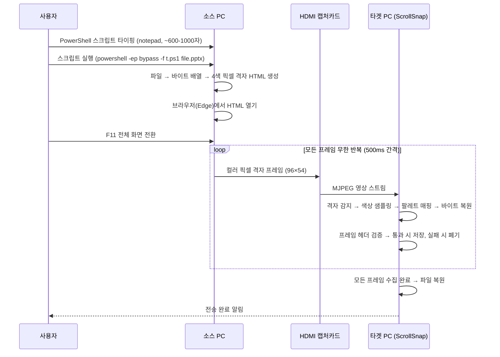

# ScrollSnap 파일 전송 방안: 컬러 픽셀 그리드 전송

## 1. 제약 조건

| 제약 | 설명 |
|------|------|
| 소스 PC에 프로그램 설치 불가 | 어떤 소프트웨어도 설치하지 않음 |
| 소스 PC에 인터넷 없음 | 온라인 도구나 웹페이지 접속 불가 |
| 전송 경로는 HDMI만 가능 | HDMI → 캡처카드 → USB (단방향) |
| 역방향 통신 불가 | 타겟 PC가 소스 PC에 피드백 불가 |
| **소스 PC에 파일 전달 불가** | USB, 네트워크 등 어떤 방법으로도 소스 PC에 파일을 가져갈 수 없음 |
| **사람의 키보드 입력이 유일한 입력 수단** | 소스 PC에서 실행할 모든 코드는 사람이 직접 타이핑해야 함 |
| 터미널 사용 가능 | cmd.exe, PowerShell 사용 가능 |
| Windows 내장 도구만 사용 | PowerShell, .NET Framework, certutil, notepad, Edge 등 |

### 1.1 이 제약이 의미하는 것

```
소스 PC에서 가능한 것:
  ✅ cmd.exe / PowerShell 명령어 실행
  ✅ Windows 내장 프로그램 사용 (notepad, Edge, mspaint 등)
  ✅ PowerShell에서 .NET Framework 클래스 호출
  ✅ certutil로 파일을 base64로 변환
  ✅ 사람이 키보드로 코드/명령어 타이핑

소스 PC에서 불가능한 것:
  ❌ 외부에서 파일 가져오기 (USB, 네트워크 등)
  ❌ 인터넷에서 다운로드
  ❌ 소프트웨어 설치
  ❌ 외부 DLL / 라이브러리 사용
```

---

## 2. 방안: 컬러 픽셀 그리드 전송

### 2.1 핵심 아이디어

파일 데이터의 각 바이트를 **4개의 컬러 픽셀**로 변환하여 화면에 격자 형태로 표시한다. **픽셀의 색상을 직접 판독**하여 데이터를 복원한다.

```
1 바이트 (8비트) = 4 픽셀 (각 2비트)

바이트 값: 0xA7 = 10 10 01 11 (2진수)
                    ↓  ↓  ↓  ↓
픽셀 색상:         빨강 빨강 파랑 흰색

4색 팔레트:
  00 = 검정 (Black)    #000000
  01 = 파랑 (Blue)     #0000FF
  10 = 빨강 (Red)      #FF0000
  11 = 흰색 (White)    #FFFFFF
```

### 2.2 전체 워크플로우



---

## 3. 소스 PC 상세 설계

### 3.1 셀 크기 클래스

캡처 장치의 사양에 따라 셀 크기를 선택할 수 있다. 셀이 작을수록 격자 밀도가 높아져 프레임당 데이터 용량이 증가하지만, 캡처 품질 요구사항도 높아진다.

| 클래스 | 셀 크기 | 센터 샘플 | 마진 | 격자 | 셀 수 | 데이터/프레임 | 대 Standard |
|--------|---------|-----------|------|------|-------|--------------|------------|
| **Standard** (기본) | 20×20 | 10×10 | 5px | 96×54 | 5,184 | 1,288 B | 1.0× |
| Enhanced | 15×15 | 7×7 | 4px | 128×72 | 9,216 | 2,296 B | 1.78× |
| Maximum | 12×12 | 6×6 | 3px | 160×90 | 14,400 | 3,592 B | 2.79× |

#### 클래스별 캡처 장치 요구사항

| 클래스 | 캡처카드 | 캡처 해상도 | 압축 방식 | 비고 |
|--------|---------|------------|----------|------|
| **Standard** | USB 2.0 포함 제한 없음 | 720p 내부 처리 허용 | MJPEG Q60+ | 저가형 캡처카드(MS2109 등) 호환 |
| Enhanced | USB 3.0 이상 | 네이티브 1080p 필수 | MJPEG Q80+ 또는 비압축 | 720p 다운스케일 시 실효 마진 부족 |
| Maximum | USB 3.0 이상 | 네이티브 1080p 필수 | 비압축 전용 (YUY2/NV12) | MJPEG 아티팩트 시 3px 마진 부족 |

> **기본값**: Standard. 캡처카드 사양이 불확실하면 Standard를 선택한다.
> 선택한 클래스에 따라 소스 PC 스크립트의 격자 파라미터(w, h)가 자동으로 설정된다.

> **본 문서의 이후 설명은 Standard 클래스(20×20, 96×54)를 기준으로 한다.** 다른 클래스는 격자 크기, 프레임당 데이터량, 타겟 측 샘플링 파라미터(센터 샘플/마진)가 달라지며, 4색 팔레트/비트 순서/헤더 구조/반복 전송 프로토콜은 동일하다.

### 3.2 인코딩 사양

| 항목 | 값 | 근거 |
|------|---|------|
| 격자 해상도 | 96 × 54 셀 (Standard) | 클래스에 따라 다름 (3.1절 참조). Standard: 1920÷20=96, 1080÷20=54 |
| 색상 수 | 4색 (2비트/셀) | MJPEG 압축 아티팩트에도 안정적 구분 가능 |
| 프레임당 셀 수 | 5,184 (Standard) | 격자 크기에 따라 다름 (3.1절 참조) |
| 프레임 총 용량 | 1,296 바이트 (Standard) | 헤더 8B + 데이터 1,288B. 클래스별 용량은 3.1절 참조 |
| 프레임 전환 간격 | 500ms (2fps) | PowerShell/브라우저 렌더링 안정성 |
| 화면 표시 | 전체 화면, NearestNeighbor 확대 | `image-rendering: pixelated` |
| 최대 파일 크기 | 실용 상한 ~50MB | 소스 HTML에 base64(×1.33)를 삽입하고, JS 문자열(UTF-16 등) 처리로 브라우저 메모리 소비가 원본의 수 배(환경에 따라 4~6배 이상)로 증가할 수 있음. 탭 메모리 한계는 브라우저·OS·버전에 따라 다름(통상 1~4GB). 다만 5MB 전송에 ~1시간 소요되므로 실사용 범위에서는 메모리보다 시간이 제약 |

> **전송 데이터**: 소스 스크립트는 파일을 base64로 인코딩하여 HTML에 삽입하지만, 브라우저 내 JavaScript가 `atob()`로 디코딩한 **원본 바이트**를 픽셀로 변환한다. base64는 HTML 삽입 수단일 뿐, 전송 데이터는 원본 파일 바이트이다.

> **해상도 전제**: 위 격자 계산은 HDMI 출력 및 캡처 프레임이 1920×1080인 경우를 가정한다. 다른 해상도에서는 셀 크기 클래스와 격자 파라미터를 캡처 해상도에 맞게 재설정해야 한다.
### 3.3 4색 팔레트

HDMI → MJPEG 캡처 체인에서 안정적으로 구분 가능한 4색을 선택한다. 휘도(luma) 차이와 원색 분리를 함께 고려한 조합:

| 비트값 | 색상 | RGB | 휘도 (Y) | 비고 |
|--------|------|-----|----------|------|
| 00 | 검정 | (0, 0, 0) | 0 | 최저 휘도 |
| 01 | 파랑 | (0, 0, 255) | 29 | 저휘도 |
| 10 | 빨강 | (255, 0, 0) | 76 | 중휘도 |
| 11 | 흰색 | (255, 255, 255) | 255 | 최고 휘도 |

> 대부분의 환경에서 구분 가능하도록 선택했으며, 캡처 품질/다운스케일에 따라 오분류가 발생할 수 있어 §5.2 캘리브레이션을 권장한다.

### 3.4 프레임 구조

각 프레임의 첫 8바이트(32셀)는 **헤더**, 나머지는 **데이터**:

```
프레임 레이아웃 (96×54 격자):

행 0:  [헤더: 32셀][데이터: 64셀]       ← 헤더 8바이트 + 데이터 16바이트
행 1~53: [데이터: 96셀 × 53행 = 5,088셀]  ← 데이터 1,272바이트

헤더 구조 (8바이트 = 32셀):
  바이트 0: 0x53 ('S') — 매직넘버 (동기화 마커)
  바이트 1: 0x43 ('C') — 매직넘버 (동기화 마커)
  바이트 2: 프레임 번호 상위 바이트
  바이트 3: 프레임 번호 하위 바이트
  바이트 4: 총 프레임 수 상위 바이트
  바이트 5: 총 프레임 수 하위 바이트
  바이트 6: 파일 식별자 상위 바이트 (SHA-256 처음 2바이트 — 간이 식별용, 무결성 검증 아님)
  바이트 7: 파일 식별자 하위 바이트

데이터 영역: 1,288 바이트/프레임 (5,184 - 32 = 5,152 셀 ÷ 4)
```

> **비트·셀 순서 규약**:
> - **바이트→비트 분해**: MSB-first (상위 2비트부터 추출: 비트7-6 → 비트5-4 → 비트3-2 → 비트1-0)
> - **셀 배치 순서**: 행 우선(row-major), 좌→우, 상→하 (셀 인덱스 k에 대해 x = k % 96, y = ⌊k / 96⌋)
> - **마지막 프레임 패딩**: 남는 셀은 0x00(검정)으로 채움

### 3.5 전송 과정

```
소스 PC에서 스크립트 실행 시:

1. 파일 읽기 → 바이트 배열
2. SHA-256 해시 계산 → 처음 2바이트를 파일 식별자로 추출 (간이 식별용)
3. 총 프레임 수 계산: ceil(파일크기 / 1,288)
4. HTML 파일 생성:
   - 파일 데이터를 base64로 인코딩하여 JS 변수에 삽입
   - JS가 base64를 디코딩(`atob`)한 원본 바이트를 프레임 단위로 분할
   - 각 프레임에 헤더 추가
   - Canvas에 96×54 격자로 렌더링
   - 500ms 간격으로 다음 프레임 표시
   - 마지막 프레임 후 처음부터 반복
5. 기본 브라우저(Edge)에서 HTML 열기
6. 사용자는 전체 화면(F11) 전환
7. 타겟 PC에서 캡처 완료 신호를 받을 때까지 방치
```

---

## 4. 소스 PC 스크립트

> 아래 스크립트는 Standard 클래스(`w=96, h=54`) 기준이다. 다른 클래스 선택 시 격자 파라미터가 변경된다:
> | 클래스 | `w` | `h` | `hp` (헤더 셀) |
> |--------|-----|-----|------|
> | Standard | 96 | 54 | 32 |
> | Enhanced | 128 | 72 | 32 |
> | Maximum | 160 | 90 | 32 |

### 4.1 입력 방법

소스 PC에서 스크립트를 입력하는 워크플로우:

```
Step 1: notepad로 스크립트 파일 생성
  > notepad %TEMP%\t.ps1

Step 2: 아래 스크립트를 타이핑 후 저장 (Ctrl+S → 닫기)

Step 3: 스크립트 실행
  > powershell -ep bypass -f %TEMP%\t.ps1 C:\path\to\file.pptx

Step 4: 브라우저가 열리면 F11 (전체 화면)

Step 5: 타겟 PC에서 "전송 완료" 표시될 때까지 대기
```

> 스크립트는 한 번만 타이핑하면 된다. 이후 다른 파일 전송 시 Step 3만 반복한다.

### 4.2 최소 버전 (약 600자)

헤더 없이 순수 데이터만 표시하는 가장 간단한 버전. 소규모 파일이나 동작 확인용.

```powershell
$d=[Convert]::ToBase64String([IO.File]::ReadAllBytes($args[0]))
$h=@"
<canvas id=c style="width:100vw;height:100vh;image-rendering:pixelated;display:block">
</canvas><script>
var d=atob('$d'),w=96,h=54,B=w*h/4|0,T=Math.ceil(d.length/B),f=0,
c=document.getElementById('c'),x;c.width=w;c.height=h;
x=c.getContext('2d');document.body.style='margin:0;overflow:hidden';
var P=['#000','#00f','#f00','#fff'];
setInterval(function(){
x.fillStyle='#000';x.fillRect(0,0,w,h);
var o=f*B;
for(var i=0;i<B&&o+i<d.length;i++){var v=d.charCodeAt(o+i);
for(var j=0;j<4;j++){var k=i*4+j;
x.fillStyle=P[v>>6-j*2&3];x.fillRect(k%w,k/w|0,1,1)}}
document.title='F'+(f+1)+'/'+T;f=(f+1)%T},500)</script>
"@
$h|Out-File $env:TEMP\t.html -Enc utf8
Start-Process $env:TEMP\t.html
```

**특성**:
- 타이핑 분량: 약 **600자** (약 5분)
- 기능: 파일 데이터를 컬러 격자로 표시, 프레임 자동 순환
- 프레임 헤더: 없음 (타이틀 바에 프레임 번호만 표시)
- 타겟 측 디코딩: 프레임 내용 해시로 프레임 식별/중복 제거 (전체 화면 모드에서는 타이틀 바 불가)

### 4.3 전체 버전 (약 1,000자)

프레임 헤더(매직넘버, 프레임 번호, 총 프레임 수, 파일 해시)를 포함하는 정식 버전.

```powershell
$b=[IO.File]::ReadAllBytes($args[0])
$s=[Security.Cryptography.SHA256]::Create().ComputeHash($b)
$hi='{0:X2}{1:X2}'-f$s[0],$s[1]
$d=[Convert]::ToBase64String($b)
$h=@"
<canvas id=c style="width:100vw;height:100vh;image-rendering:pixelated;display:block">
</canvas><script>
var d=atob('$d'),w=96,h=54,hp=32,dp=w*h-hp,B=dp/4|0,
T=Math.ceil(d.length/B),f=0,hi=0x$hi,
c=document.getElementById('c'),x;c.width=w;c.height=h;
x=c.getContext('2d');document.body.style='margin:0;overflow:hidden';
var P=['#000','#00f','#f00','#fff'];
function enc(v,pos){for(var j=0;j<4;j++){var k=pos+j;
x.fillStyle=P[v>>6-j*2&3];x.fillRect(k%w,k/w|0,1,1)}}
setInterval(function(){
x.fillStyle='#000';x.fillRect(0,0,w,h);
enc(0x53,0);enc(0x43,4);enc(f>>8&0xFF,8);enc(f&0xFF,12);
enc(T>>8&0xFF,16);enc(T&0xFF,20);enc(hi>>8&0xFF,24);enc(hi&0xFF,28);
var o=f*B;
for(var i=0;i<B&&o+i<d.length;i++){var v=d.charCodeAt(o+i);
enc(v,hp+i*4)}
document.title='$($args[0])|F'+(f+1)+'/'+T+'|$hi';
f=(f+1)%T},500)</script>
"@
$h|Out-File $env:TEMP\t.html -Enc utf8
Start-Process $env:TEMP\t.html
```

**특성**:
- 타이핑 분량: 약 **1,000자** (약 8~12분)
- 프레임 헤더: 매직넘버(SC) + 프레임 번호 + 총 프레임 수 + 파일 해시 2바이트
- 타겟 측에서 프레임 식별, 중복 제거, 완료 감지 가능
- 파일 해시로 동일 파일 재전송 감지

### 4.4 WinForms 폴백 버전 (약 750자)

일부 기업 보안 정책 등으로 브라우저의 로컬 HTML JavaScript 실행이 제한되는 환경에서 사용하는 대안.

```powershell
Add-Type -A System.Windows.Forms,System.Drawing
$d=[IO.File]::ReadAllBytes($args[0])
$w=96;$h=54;$N=$w*$h/4;$T=[math]::Ceiling($d.Length/$N);$n=0
$P=[Drawing.Color]::Black,[Drawing.Color]::Blue,
[Drawing.Color]::Red,[Drawing.Color]::White
$b=New-Object Drawing.Bitmap $w,$h
$f=New-Object Windows.Forms.Form
$f.WindowState=2;$f.FormBorderStyle=0
$p=New-Object Windows.Forms.PictureBox
$p.Dock=5;$p.SizeMode=1;$p.Image=$b
$f.Controls.Add($p)
$t=New-Object Windows.Forms.Timer
$t.Interval=500
$t.Add_Tick({
$g=[Drawing.Graphics]::FromImage($b);$g.Clear([Drawing.Color]::Black);$g.Dispose()
$o=$script:n*$N
for($i=0;$i -lt $N -and $o+$i -lt $d.Length;$i++){
$v=$d[$o+$i]
for($j=0;$j -lt 4;$j++){$k=$i*4+$j
$b.SetPixel($k%$w,[math]::Floor($k/$w),
$P[$v-shr(6-$j*2)-band 3])}}
$p.Refresh();$f.Text="$($script:n+1)/$T"
$script:n=($script:n+1)%$T})
$t.Start()
[Windows.Forms.Application]::Run($f)
```

**실행**: `powershell -sta -ep bypass -f %TEMP%\t.ps1 C:\file.pptx`

**특성**:
- 타이핑 분량: 약 **750자** (약 6~8분)
- 브라우저 불필요 (PowerShell 창에서 직접 렌더링)
- 성능: SetPixel 호출로 인해 ~1~3fps (HTML 버전보다 느림)
- `-sta` 플래그 필수 (WinForms UI 스레드)

---

## 5. 타겟 PC 디코딩

### 5.1 디코딩 파이프라인

```
캡처 프레임 (1920×1080 MJPEG)
    ↓
[1단계] 격자 감지
    - 기본: 전체 화면 모드이므로 고정 위치/크기 가정 (격자가 프레임을 꽉 채움)
    - 대안: 밝기 변화 패턴으로 블록 경계 추정 (비전체화면 또는 스케일링 발생 시)
    - 자동 감지 실패 시 사용자가 격자 영역을 수동 지정하는 폴백 제공
    ↓
[2단계] 색상 샘플링
    - 각 블록의 중앙 영역의 평균 RGB 추출 (Standard: 10×10, 클래스별 3.1절 참조)
    - JPEG 아티팩트가 집중되는 경계 영역 제외
    ↓
[3단계] 팔레트 매핑
    - 샘플링된 RGB를 4색 팔레트 중 최근접 색상에 매핑
    - 유클리드 거리: dist = (R₁-R₂)² + (G₁-G₂)² + (B₁-B₂)²
    - 매핑 결과 = 2비트 값 (00, 01, 10, 11)
    ↓
[4단계] 바이트 복원
    - 4개 픽셀의 2비트 값을 결합 → 1바이트
    - MSB-first: 픽셀 0 = 비트 7-6(상위), 픽셀 3 = 비트 1-0(하위)
    ↓
[5단계] 프레임 검증 (전체 버전)
    - 헤더 확인: 매직넘버 0x53, 0x43 ('SC')
    - 프레임 번호, 총 프레임 수 추출
    - 파일 식별자 확인
    - 검증 실패 시 프레임 폐기
    ↓
[6단계] 프레임 축적
    - 검증 통과한 프레임을 번호별로 저장
    - 같은 번호의 프레임이 이미 있으면 무시 (중복 제거)
    - 새 프레임 수집 시 진행률 표시
    ↓
[7단계] 파일 복원 (모든 프레임 수집 완료 시)
    - 프레임 0 ~ N-1의 데이터를 순서대로 결합
    - 파일 식별자 확인 (헤더의 SHA-256 앞 2바이트와 비교)
    - 원본 파일 다운로드
```

### 5.2 적응형 캘리브레이션

캡처 환경(모니터 감마, 캡처카드 색 재현, MJPEG 품질)에 따라 실제 캡처되는 색상이 원본과 다를 수 있다. **처음 수 프레임의 데이터**를 활용하여 실제 팔레트 클러스터 중심을 학습한다:

```
캘리브레이션 과정:

1. 처음 10~20 프레임을 캡처
2. 모든 블록의 RGB 값을 히스토그램으로 수집
3. K-means (K=4)로 4개 클러스터 중심 도출
4. 클러스터 중심을 실제 팔레트로 사용
5. 이후 프레임부터 학습된 팔레트로 디코딩
```

> 캘리브레이션 실패 조건: 클러스터 간 최소 거리가 임계치 미만이거나 4개 미만의 유효 클러스터가 형성되면, 캘리브레이션을 무효로 하고 고정 팔레트(이론값)로 디코딩한다. 또는 더 많은 프레임을 수집하여 재시도한다.

### 5.3 프레임 반복을 통한 손실 복구

소스 PC는 모든 프레임을 순서대로 표시한 후, 처음부터 다시 반복한다. 타겟 PC는 각 프레임을 **여러 번** 캡처할 기회를 가진다:

```
소스 PC 표시 순서:
  F0, F1, F2, ..., F(N-1), F0, F1, F2, ..., F(N-1), F0, ...
                    ↑ 1주기           ↑ 2주기

타겟 PC 수집 과정:
  1주기: F0✅, F1✅, F2❌(헤더 검증 실패), F3✅, ..., F(N-1)✅
  2주기: F0(이미 있음), F1(이미 있음), F2✅(이번에 성공!), ...
  → 모든 프레임 수집 완료 → 파일 복원
```

**파운틴 코드 대비 장점/단점**:

| | 프레임 반복 | 파운틴 코드 |
|---|---|---|
| 소스 측 구현 | **극히 간단** (단순 루프) | 복잡 (LT 인코딩) |
| 타이핑 부담 | **없음** | 수백 줄 추가 |
| 필요 프레임 수 | 모든 N개 필요 | 임의 K+ε개 |
| 문제 프레임 | 반복 시도로 해결 | 우회 가능 |
| 이론적 효율 | 낮음 | 높음 |

> 소스 PC의 타이핑 제약을 고려하면, **프레임 반복**이 파운틴 코드보다 훨씬 실용적이다. 파운틴 코드는 소스 측에 수백 줄의 인코딩 코드가 필요하지만, 프레임 반복은 단순 루프만으로 손실 프레임을 재시도하여 복구하는 효과를 얻는다 (단, 특정 프레임이 지속 실패하면 §8 완화 전략 참조).

---

## 6. 예상 성능

### 6.1 처리량 계산

```
클래스별 프레임당 파일 데이터 (전체 버전, payload — 헤더 8B 제외):
  Standard (20×20, 96×54):   1,288 B/프레임
  Enhanced (15×15, 128×72):  2,296 B/프레임
  Maximum  (12×12, 160×90):  3,592 B/프레임

1주기 소요 시간:
  T = ceil(파일크기 / 프레임당 데이터) × 0.5초

반복 고려 (2주기로 완료 가정 시 실효 속도):
  Standard: 1,288 × 2fps / 2 ≈ 1,288 B/s ≈ 약 1.3 KB/s
  Enhanced: 2,296 × 2fps / 2 ≈ 2,296 B/s ≈ 약 2.2 KB/s
  Maximum:  3,592 × 2fps / 2 ≈ 3,592 B/s ≈ 약 3.5 KB/s

프레임 성공률 90% 가정 (1주기 내 90% 수집):
  Standard: ≈ 약 1.1 KB/s
  Enhanced: ≈ 약 2.0 KB/s
  Maximum:  ≈ 약 3.2 KB/s
```

### 6.2 파일 크기별 예상 소요 시간

| 파일 크기 | Standard (20×20) | Enhanced (15×15) | Maximum (12×12) |
|----------|-----------------|-----------------|-----------------|
| 10 KB | 8프레임 / ~8초 | 5프레임 / ~5초 | 3프레임 / ~3초 |
| 100 KB | 80프레임 / ~1분 20초 | 45프레임 / ~45초 | 29프레임 / ~29초 |
| 500 KB | 398프레임 / ~6분 38초 | 223프레임 / ~3분 43초 | 143프레임 / ~2분 23초 |
| 1 MB | 815프레임 / ~13분 35초 | 457프레임 / ~7분 37초 | 292프레임 / ~4분 52초 |
| 5 MB | 4,071프레임 / ~1시간 8분 | 2,284프레임 / ~38분 | 1,460프레임 / ~24분 |

> 예상 완료 시간은 2주기 기준. 프레임 수 = ceil(파일크기 / 클래스별 데이터량), 500ms 간격.

---

## 7. MJPEG 아티팩트 대응 전략

### 7.1 블록 중앙 샘플링

격자의 각 셀에서 중앙 영역만 샘플링한다. 셀 크기와 샘플 영역은 선택한 클래스에 따라 결정된다 (3.1절 참조). JPEG 아티팩트는 블록 경계에 집중되므로, 중앙부는 깨끗하다. 아래는 Standard 클래스(20×20, 센터 10×10) 기준이다.

```
Standard 클래스 — 20×20 화면 블록 (캡처 후):

┌──────────────────┐
│░░░░░░░░░░░░░░░░░░│ ← JPEG 경계 아티팩트
│░░┌────────────┐░░│
│░░│            │░░│
│░░│  샘플 영역 │░░│ ← 10×10 중앙 (안전 영역)
│░░│  (평균 RGB) │░░│
│░░└────────────┘░░│
│░░░░░░░░░░░░░░░░░░│
└──────────────────┘
```

### 7.2 최근접 색상 매핑

```javascript
// 타겟 PC 디코더 (JavaScript)
const PALETTE = [[0,0,0], [0,0,255], [255,0,0], [255,255,255]];

function nearestColor(r, g, b) {
    let minDist = Infinity, best = 0;
    for (let i = 0; i < PALETTE.length; i++) {
        const [pr, pg, pb] = PALETTE[i];
        const dist = (r-pr)**2 + (g-pg)**2 + (b-pb)**2;
        if (dist < minDist) { minDist = dist; best = i; }
    }
    return best; // 0, 1, 2, 또는 3
}
```

### 7.3 NearestNeighbor 스케일링 설정

소스 PC에서 Canvas(Standard: 96×54)를 CSS로 전체 화면 확대할 때, `image-rendering: pixelated`를 지정하여 블록 경계가 선명하게 유지되도록 한다:

```css
canvas {
    width: 100vw;
    height: 100vh;
    image-rendering: pixelated;  /* Chrome/Edge */
    image-rendering: crisp-edges; /* Firefox 폴백 */
}
```

---

## 8. 리스크 및 완화 전략

| 리스크 | 영향 | 완화 전략 |
|--------|------|----------|
| Windows DPI 스케일링 (125%, 150%) | 격자 좌표 어긋남 | 캘리브레이션으로 실측 보정. 소스 PC에서 F11 전체 화면 사용 |
| 캡처카드별 색 재현 차이 | 팔레트 매핑 오류 | 적응형 캘리브레이션 (K-means) |
| 알림/팝업이 화면 가림 | 프레임 오염 | 매직넘버(SC) 검증으로 오염 프레임 폐기 |
| 일부 보안 정책에서 로컬 HTML JS 제한 | 스크립트 실행 불가 | WinForms 폴백 버전 사용 (4.4절) |
| PowerShell 실행 정책 제한 | 스크립트 실행 불가 | `-ep bypass` 플래그 사용 |
| 특정 프레임이 반복적으로 실패 | 완료 불가 | 타겟 PC에서 문제 프레임 번호 표시. 셀 크기 클래스 변경, 캔버스 오프셋(여백) 조정, 또는 캡처 해상도/코덱 변경으로 격자 위치 이동 |
| 타이핑 오류 | 스크립트 동작 실패 | notepad에서 타이핑 → 저장 전 확인. 에러 시 수정 후 재실행 |
| 대용량 파일 시 브라우저 메모리 부족 | 스크립트 실행 불가 또는 탭 크래시 | base64 전체를 HTML에 삽입하므로 브라우저·OS 환경에 따라 메모리 한계 도달 가능. 실용 상한 ~50MB이나, 전송 시간(5MB≈1h)이 먼저 병목 |

---

## 9. 구현 로드맵

| 순서 | 단계 | 내용 | 난이도 |
|------|------|------|--------|
| 1 | 최소 버전 검증 | 소스 스크립트(최소) + 타겟 디코더 기본 구현 | 낮음 |
| 2 | 격자 감지 | 캡처 프레임에서 96×54 격자 자동 감지 | 중간 |
| 3 | 색상 디코더 | 중앙 샘플링 + 팔레트 매핑 + 바이트 복원 | 낮음 |
| 4 | 프레임 축적/복원 | 프레임 중복 제거 + 순서 정렬 + 파일 복원 | 낮음 |
| 5 | 전체 버전 통합 | 헤더 파싱 + 해시 검증 + 진행률 표시 | 중간 |
| 6 | 캘리브레이션 | 적응형 팔레트 학습 | 중간 |
| 7 | 안정성 테스트 | 다양한 캡처 장비, DPI 설정, 파일 크기 테스트 | 높음 |

---

## 10. 선행 기술 참고

| 프로젝트/기술 | 설명 | 본 방안과의 관계 |
|-------------|------|----------------|
| [libcimbar](https://github.com/sz3/libcimbar) | 컬러 아이콘 매트릭스 바코드 (850 Kb/s) | 컬러 픽셀 인코딩의 참고 사례 |
| [JAB Code](https://github.com/jabcode/jabcode) | ISO/IEC 23634:2022 컬러 2D 바코드 | 파인더 패턴, 정렬 알고리즘 참고 |
| [txqr](https://github.com/divan/txqr) | 애니메이션 QR + 파운틴 코드 | 프레임 기반 전송 프로토콜 참고 |
| [jsQR](https://github.com/cozmo/jsQR) | 브라우저 QR 디코더 | Canvas 프레임 처리 패턴 참고 |

---

## 11. 결론

강화된 제약 조건(소스 PC에 파일 전달 불가, 키보드 입력만 가능)을 충족하는 **컬러 픽셀 그리드 전송** 방식을 제안한다.

**핵심 설계 결정**:

1. **결정적 판독**: 4색 픽셀로 데이터를 인코딩하여, 색상값 비교만으로 높은 정확도의 데이터 복원 가능
2. **자동 반복 전송**: 소스 PC가 프레임을 무한 루프하여, 타겟 PC가 놓친 프레임을 자연히 재수집
3. **최소 타이핑**: 소스 PC 스크립트를 약 600~1,000자로 최소화. 5~12분 타이핑으로 실행 가능
4. **소형 비트맵 + 확대**: Canvas를 전체 화면으로 확대하여, 캡처 시 큰 셀 블록 생성 (Standard: 96×54, 20×20 블록)
5. **캡처 장치 적응**: 3단계 셀 크기 클래스(Standard/Enhanced/Maximum)로 캡처카드 사양에 맞춰 처리량 최적화 (1.0× ~ 2.79×)

---

*문서 작성일: 2026-02-28*
*프로젝트: ScrollSnap*
*관련 문서: ScrollSnap_DirectText_Transfer_Method.md*
